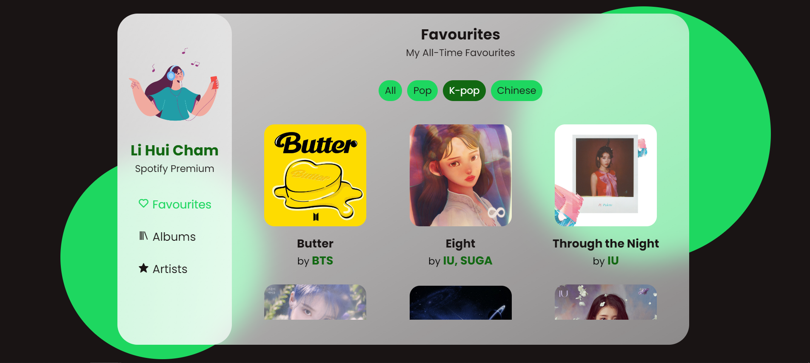

# My Spotify Recommendations (Glassmorphism)

- Created using HTML, CSS, JavaScript.
- **Glassmorphism** design using CSS ```background-image: linear-gradient()``` property. 
- Responsive side navigation bar using Vanilla JavaScript.
- **MixItUp filter** is used for categorization of songs in Favourites section. 

### Spotify Color Code 

```
--spotify-green: rgba(30, 215, 96, 1);
--spotify-black: rgba(25, 20, 20, 1);
```

### Glass Effect (CSS property)

```
--glass-color: linear-gradient(
    to right bottom, 
    rgba(255, 255, 255, 0.8), 
    rgba(255, 255, 255, 0.5)
);

```


### MIXITUP (JavaScript function)

```
let mixer = mixitup('.favourites_container', {
    selectors: {
        target: '.fav_card'
    },
    animation: {
        duration: 300
    }
});

```



To use MixItUp 3 or read the documentation, visit [KunkaLabs website](https://www.kunkalabs.com/mixitup/).  
Visit [project page](https://lihuicham.github.io/my-spotify-recommendations/) to try out the MixItUp filter in the Favourites section !  

### Glass Cards with Shadow (CSS Property)
The project uses the ```box-shadow``` property in CSS to achieve a pop-up feeling for the cards, that are of glassmorphism designed too.  


### Blur Effect (CSS property)

Blur effect is applied in the backdrop to achieve the glassy feeling.

```
backdrop-filter: blur(1.2rem);
```


### Hover effects using CSS 
Scaling (transformation), shadow and color-changing effects are added in ```element:hover``` property for responsiveness. 

<br>

Note: Project is **best viewed using laptop/desktop screen** due to the size of the glass dashboard and cards. Mobile version of this webpage is unavailable at the moment.  

**Click here to see my Spotify recommendations: [Project Demo](https://lihuicham.github.io/my-spotify-recommendations/)**
